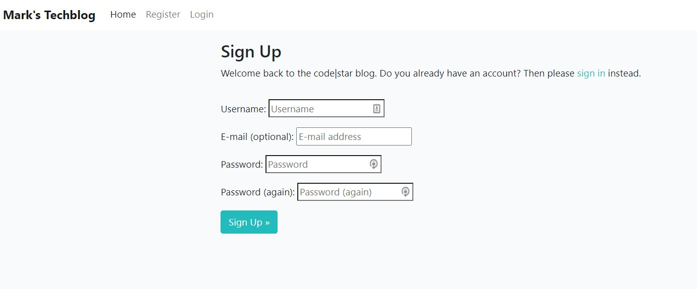
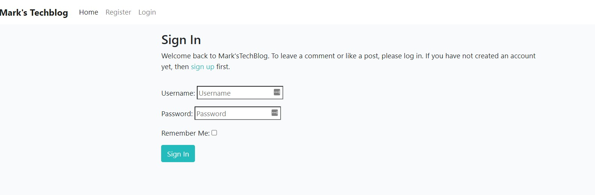
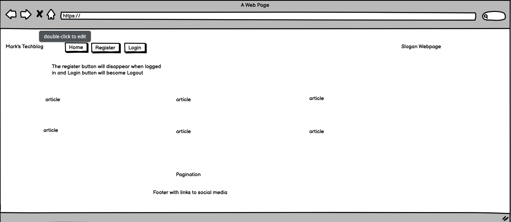

<h1 align="center">Mark's TechBlog</h1>

### **Live Site**
[MarkTechBlog live Website](https://ci-pp4-marktechblog.herokuapp.com/)

### **Repository:**
[MarkTechBlog repository](https://github.com/Markp1312/PP4-DjangoTechBlog)

# About

As the name indicates, Mark's TechBlog is a website based on Django where the owner (Mark) shares his favourite Technical articles and Industry information.
Readers of the Blog can comment and like articles and this creates a interactive community where a variety of topics can be discussed. 

# Table of Contents

[User Experience](#user-experience)

[Features](#features)

[Features to be Implemented](#features-to-be-implemented)

[Wireframes](#wireframes)

[Databases](#databases)

[Technologies Used](#technologies-used)

[Testing](#testing)

[Validator Testing](#validator-testing)

[Bugs Found](#bugs-found)

[Deployment](#deployment)

[Credit](#credit)

[Acknowledgments](#Acknowledgments)

# User Experience
## User Stories
### Superuser / Admin
- View likes: As Admin I can view the number of likes on each post so that I can see which is the most popular or viral.
- View comments: As Admin I can view comments on an individual post so that I can read the conversation.
- Manage posts: As a Site Admin I can create, read, update and delete posts so that I can manage my blog content.
- Create drafts: As a Site Admin I can create draft posts so that I can finish writing the content later.
- Approve comments: As a Site Admin I can approve or disapprove comments so that I can filter out objectionable comments.

### Site User
- View post list: As a Site User I can view a list of posts so that I can select one to read.
- Open a post: As a Site User I can click on a post so that I can read the full text
- View likes: As a Site User, I can view the number of likes on each post so that I can see which is the most popular or viral.
- View comments: As a Site User I can view comments on an individual post so that I can read the conversation.
- Account registration: As a Site User I can register an account so that I can comment and like
- Comment on a post: As a Site User I can leave comments on a post so that I can be involved in the conversation
- Like / Unlike: As a Site User I can like or unlike a post so that I can interact with the content.

# Features
- Landing Image - All Users

- Navbar - Guests

- Navbar - Logged in Users

- View articles - All Users

- Create an account - All Users

- Login - all users

## Colour Scheme 

I have chosen to use the following color combination:

- #F9FAFC (White)
- #4A4A4F (Black / Grey)

This combination creates a nice clean look.

## Font Choice

- I have chosen the Lato, sans-serif font for this project.

## Font Awesome 
I have used the Font Awesome Emoticons for the social media icons in the footer
[Font Awesome](https://www.fontawesome.com/). 

# Features to be Implemented
- Admin Panel accessible through webpage.
- Admin can edit / modify posts through webpage.
- Users can add posts to blog.
- Reset password functionality.
- Email verification when user signs up.
- Sent out a digest style email when blog grows.
- User profile functionality.

# Wireframes
All wireframes were created used [Balsamiq](https://balsamiq.com/)

# Structure
I have kept the structure simple to not crowd the user with information. The homepage is basic and straightforward. Users can click on a tile to view the full post and like or add a comment the post.

The website is made of one app:
1. Blog

All visitors to the site can view news articles, however a user must register/login to have access to the comment and like functionality:

## Databases

### User

For this project I used Django's User model to store registration information allowing the users to create an account. 

### Posts

For the Author to be able to upload the post have created the below Post Model:

Title and Slug are required fields.
Author is based on the user who is currently logged in, Featured Image - uses a placeholder if no image is uploaded and Excerpt - Is where the author can add a brief description of the topic.

# Technologies Used

## Languages Used

[html](https://en.wikipedia.org/wiki/HTML)

[CSS](https://en.wikipedia.org/wiki/CSS)

[Python](https://www.python.org/)

[JavaScript](https://www.javascript.com/)

## Frameworks, Libraries and Programmes Used 

[GitHub](https://github.com/) - Holds the repository of my project, GitHub connects to GitPod and Heroku.

[GitPod](https://gitpod.io/workspaces) – Connected to GitHub, GitPod hosted the coding space, allowing the project to be built and then committed to the GitHub repository. 

[Heroku](https://www.heroku.com/) - Connected to the GitHub repository, Heroku is a cloud application platform used to deploy this project so the backend language can be utilised/tested. 

[Django](https://www.djangoproject.com/) - This framework was used to build the foundations of this project, reducing time spent getting the project setup and prevent re-writing existing code.

[Gunicorn](https://gunicorn.org/) - Gunicorn is a pure-Python HTTP server for WSGI applications. It allows you to run any Python application concurrently by running multiple Python processes within a single dyno. It provides a perfect balance of performance, flexibility, and configuration simplicity.

[Dj Database URL](https://pypi.org/project/dj-database-url/) - This allows you to utilize the 12factor inspired DATABASE_URL environment variable to configure your Django application.

[Bootstrap](https://getbootstrap.com/) - Used to quickly add design to my website, Bootstrap focuses on mobile first design meaning this website is responsive across multiple devices ans screen sizes. 

[Cloudinary](https://cloudinary.com/?utm_source=google&utm_medium=cpc&utm_campaign=Rbrand&utm_content=492438439811&utm_term=cloudinary&gclid=Cj0KCQiAt8WOBhDbARIsANQLp96hTerzfFJ_P9lX0tEYEdtM3tSsYB6fhw-x3wQxOO0oc4hXm-A2ZBUaAptIEALw_wcB) - Used to store images online for the blog posts. 

[Summernote](https://summernote.org/) Used to add a text area field to the admin setup to enable a more comprehensive way of posting.

# Testing
## Manual Testing by User Story
### **Admin**
- View likes: As Admin I can view the number of likes on each post so that I can see which is the most popular or viral.

This has been tested by logging in as admin and the likes can be viewed on the webpage itself or through Django Admin Panel
- View comments: As Admin I can view comments on an individual post so that I can read the conversation.

Viewing comments can be done through the Webpage after these are approved through the admin panel.
  
- Manage posts: As a Site Admin I can create, read, update and delete posts so that I can manage my blog content.

Posts can be created / updated and deleted through the admin panel.
Posts can be read on the Webpage.
  
- Create drafts: As a Site Admin I can create draft posts so that I can finish writing the content later.

Draft can be created through Admin Panel and saved in here untill ready for publishing.
  
- Approve comments: As a Site Admin I can approve or disapprove comments so that I can filter out objectionable comments.

This functionality is available through the admin panel.
When a user comments, this needs to be approved before it is published.
  

### **User**
- View post list: As a Site User I can view a list of posts so that I can select one to read.

When accessing the webpage you are presented with the articles that have been published. You can click on a article and read this.  
- Open a post: As a Site User I can click on a post so that I can read the full text
  
You can click on a article and read the full text

- View likes: As a Site User, I can view the number of likes on each post so that I can see which is the most popular or viral.

The number of likes is displayed underneath each post.
  
- View comments: As a Site User I can view comments on an individual post so that I can read the conversation.

When opening a post, the user is presented with all comments that have been published on that specific post.
  
- Account registration: As a Site User I can register an account so that I can comment and like

You can register a account and this will enable functionality for commenting / liking.
  
- Comment on a post: As a Site User I can leave comments on a post so that I can be involved in the conversation
  
Commenting is available when article is opened.

- Like / Unlike: As a Site User I can like or unlike a post so that I can interact with the content.

After opening an article there is a option to like or unlike a post.

## General Manual Testing 
**Add Post**

- Go to /admin page.
- login with admin creds.
- Click Add Post.
- Fill in the post information, select publish and save.

**Remove Post**

- Go to /admin page.
- login with admin creds.
- Click Posts.
- Select the posts to delete and select action delete.

**Publish / Draft**

- Go to /admin page.
- login with admin creds.
- Click Posts.
- Open the post and toggle state under "Status".

**Approve comments**

- Go to /admin page.
- login with admin creds.
- Click Comments.
- Open the comment -> Review and click publish.

**Delete comments**

- Go to /admin page.
- login with admin creds.
- Click Comments.
- Open the comment -> Review and click delete.

**Register Account**

- Select the option to register
- After registration is succesfull, login with credentials

**Likes**

- Likes are only available to logged on users.
- You can like / unlike a post by opening a post.

# Validator Testing

- The HTML templates were validated using [W3 Validator](https://validator.w3.org/nu/#textarea). No errors were returned for the html segments.
- The CSS style sheet was validated using [W3C Validator](https://jigsaw.w3.org/css-validator/#validate_by_input), no errors were returned.
- The JavaScript files were run through [JSHint](https://jshint.com/).
- The code was validated using [PEP8](http://pep8online.com/). No errors were returned.

# Bugs Found 

- Have not found any bugs in the code.

# Deployment 

This project was deployed using Heroku. Some of the steps in this deployment process are used to get the bare minimum of this project up and running prior to adding functionality. 

See the following steps to deploy below:

1. Login to Heroku and Create a New App.

2. Give the App a name, it must be unique, and select a region. 

3. Click on 'Create App'. This will take you to a page where you can deploy your project. 

4. Next, click on the 'Resources' tab and search for 'Heroku Postgres' in the Add-ons section to add the Heroku Postgres database to the project. 

5. Click on the 'Settings' tab at the top of the page. The following steps must be completed before deployment.

6. Scroll down to Config Vars (also known as Environment Variables) and click 'Reveal Config Vars'. Here the database URL is stored, it is the connection to the database, so this must be copied and stored within env.py file within the same directory as the manage.py file. 

The env.py files is where the projects secret environment variables are stored. This file is then added to a gitnore file so it isn't stored publicly within the projects repository.  

7. Next, the secret key needs to be created within the projects env.py file on GitPod and then added to the Config Vars on Heroku. Once added, go to the settings.py file on GitPod.

8. Within the settings.py file you need to import os, import dj_database_url and then write an if statement to import the env.py file in production to avoid an error. 

9. Then, we need to replace the current insecure secret key with **os.environ.get('SECRET_KEY')**, that we set within the env.py file. 

10. Once the secret key is replaced, scroll down to DATABASES to connect to the Postgres database. Comment out the current code and add the following python dictionary:
DATABASES = {
    'default': dj_database_url.parse(os.environ.get('DATABASE_URL'))
}

11. The next step is to connect the project to Cloudinary, which is where the media files will be stored. Log into Cloudinary and copy the API environment variable. This needs to be added to the Config Vars on Heroku and to the projects env.py file, removing the 'CLOUDINARY_URL = ' from the beginning of the copied API link. 

12. Then on Heroku add to the Config Vars, DISABLE_COLLECTSTATIC = 1, as a temporary measure to enable deployment without any static files, this will be removed when it is time to deploy the full project.

13. Back onto GitPod, the cloudinary libraries installed now need to be added to the list of installed apps within the settings.py file - 'cloudinary_storage' and 'cloudinary'

14. Next we need to tell Django to use Cloudinary to store our media and static files. Toward the end of our settings.py  file we can add:

- STATIC_URL = '/static/'
- STATICFILES_STORAGE = 'cloudinary_storage.storage.StaticHashedCloudinaryStorage'
- STATICFILES_DIRS = [os.path.join(BASE_DIR, 'static')]
- STATIC_ROOT = os.path.join(BASE_DIR, 'staticfile')
- MEDIA_URL = '/media/'
- DEFAULT_FILE_STORAGE = 'cloudinary_storage.storage.MediaCloudinaryStorage'

15. Then we need to tell Django where the templates will be stored. At the top of settings.py, under BASE_DIR (the base directory), add a templates directory and then scroll down to TEMPLATES and add the templates directory variable to 'DIRS': []. 

16. Next, create the three above directories, media, static and templates, on the top level with the manage.py file. 

17. Now add our Heroku host name into allowed hosts in our settings.py file, APP_NAME.herokuapp.com, and then also add 'localhost' so the app can also run locally.

18. Finally, to complete the first deployment set up of the skeleton app, create a Procfile so that Heroku knows how to run the project. Within this file add the following:
web: gunicorn foody_family.wsgi
Web tells Heroku to allow web traffic, whilst gunicorn is the server installed earlier, a web services gateway interface server (wsgi). This is a standard that allows Python services to integrate with web servers.

19. Heroku did not currectly support deployment through Github so followed the following steps:

[Deployment guide Heroku](https://devcenter.heroku.com/articles/git)

20.  Once the project is finished deploying, click 'view' to see the newly deployed project. 

21.  Before deploying the final draft of your project you must: 
- Remove staticcollect=1 from congifvars within Heroku 
- Ensure DEBUG is set to false in settings.py file or:
    - Set DEBUG to development with: *development = os.environ.get('DEVELOPMENT', False)* above it.

22. To deploy re-do steps 19 - 21, minus reconnecting your GitHub account as it should still be connected to your App. 

# Credit
## Content 

I used the following websites to help with different areas of my project:
### Login, Logout & Registration
- [Django - How to log a user out](https://docs.djangoproject.com/en/4.0/topics/auth/default/#how-to-log-a-user-out), to help get the logout functionality working.
- [Code Institute](https://codeinstitute.net/), Think Before I blog and Hello Django walkthrough tutorials.
- [Code Institute](https://codeinstitute.net/), Learning Content.
- [Stackoverflow](https://stackoverflow.com/)

# Acknowledgments
Thank you to all who encouraged and supported me as I created my first full stack website even though the limited amount of time available (Will not change in near future unfortanetly.)
